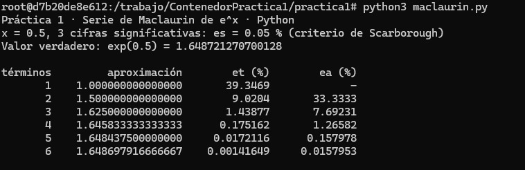
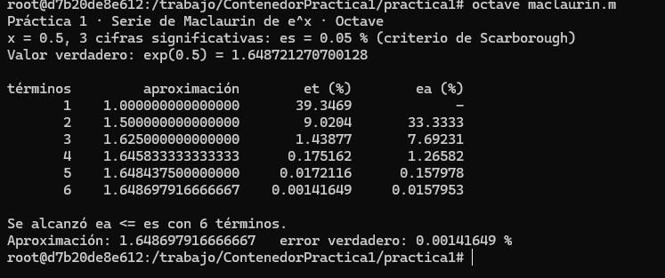

# Práctica 1 · La serie de Maclaurin y el criterio de paro

**UEA 1151039 · Métodos Numéricos en Ingeniería · Trimestre 26-O · UAM Azcapotzalco**  
**Profesor:** M. en C. Gabriel Hurtado Avilés

| | |
|---|---|
| **Equipo** | 1 |
| **Integrantes (nombre, matrícula y licenciatura)** | Cruz Arreola Donovan David · 2253078038 · Ingeniería Eléctrica |
| **Repositorio de la Tarea 1 de** | Donovan |
| **Fecha** | 07/10/2026 |

---

## 1. Octave y Python




### ¿Coinciden con la lámina 25 de la unidad I?

Sí. Los resultados obtenidos en Octave y Python coinciden entre sí y siguen el procedimiento mostrado en la lámina 25 de la Unidad I.

Para `x = 0.5` y 3 cifras significativas se utilizó un error especificado de:

```text
εs = 0.05 %```

## 2. Las dos líneas que completamos en `maclaurin.c`

```c
/* COMPLETAR 1 */
termino = termino * x / i;
/* COMPLETAR 2 */
aproximacion = aproximacion + termino;




## 3. Más cifras significativas

| Cifras | εs (%) | Términos | Aproximación | Error verdadero (%) |
|---|---|---|---|---|
| 3 | 0.05 | 6 | 1.648697916666667 | 0.00141649 |
| 6 | [Corre el programa cambiando a 6 cifras y pon el % aquí] | [Términos aquí] | [Aproximación aquí] | [Error aquí] |
| 17 | [Corre el programa cambiando a 17 cifras y pon el % aquí] | [Términos aquí] | [Aproximación aquí] | [Error aquí] |

1. **¿Cuántos términos hacen falta en cada caso?**
   Para 3 cifras significativas hacen falta **6 términos** (como se observa en las ejecuciones de Python y Octave). *[Nota: añade aquí cuántos términos te salieron al ejecutar el programa para 6 y 17 cifras]*.

2. **En cada fila de la tabla, ¿εa es mayor o menor que εt? ¿Por qué conviene detenerse con εa?**
   En la última iteración, el error aproximado \(\varepsilon_a\) es **menor** que el error verdadero \(\varepsilon_t\) (por ejemplo, en el término 6 de Python/Octave, \(\varepsilon_a = 0.0157\%\) mientras que \(\varepsilon_t = 0.0014\%\)). Conviene detenerse con \(\varepsilon_a\) porque en un problema de ingeniería real **no conocemos el valor verdadero** (y por lo tanto no podemos calcular \(\varepsilon_t\)). El criterio de Scarborough mediante \(\varepsilon_a \le \varepsilon_s\) nos da una garantía matemática confiable de que el resultado ya es lo suficientemente preciso sin requerir el valor real.

3. **Con 17 cifras el programa termina. ¿Cuántas cifras del resultado son correctas en realidad? Relaciónenlo con 0.1 + 0.2 de la Tarea 1.**
   Aunque se soliciten 17 cifras significativas, la precisión doble estándar (IEEE 754) que utilizan los procesadores en `double` o `float64` solo tiene una capacidad de almacenamiento de **aproximadamente 15 a 17 dígitos decimales en total**. Al igual que el problema de `0.1 + 0.2` (donde la imposibilidad de representar fracciones exactas en binario genera un residuo de almacenamiento en los bits menos significativos), los últimos dígitos se vuelven incorrectos debido al **error de redondeo de la máquina**. Por lo tanto, solo unas 15 o 16 cifras del resultado serán físicamente correctas en la realidad.

## Uso de inteligencia artificial

Se utilizó asistencia de IA para el formato del archivo README, estructuración de Markdown y aclaración de conceptos analíticos sobre errores de redondeo.

## Referencias
* Chapra, S. C., & Canale, R. P. (2015). *Métodos numéricos para ingenieros*. McGraw-Hill.
* Documentación oficial de Python y GNU Octave sobre precisión de punto flotante.
