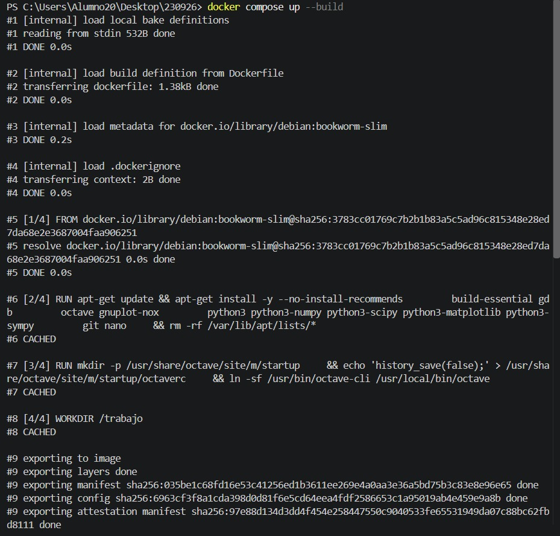
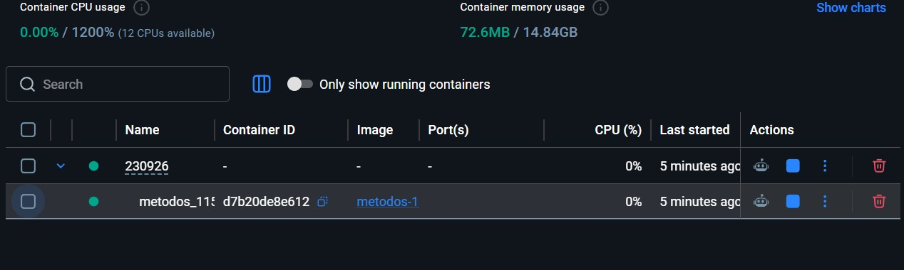
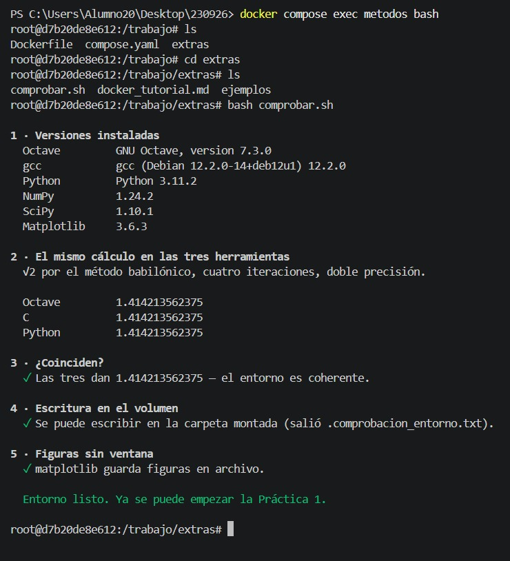
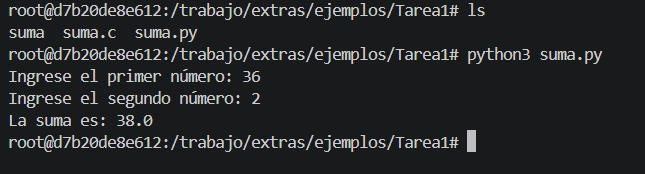

# Ejercicio 2. El README: Métodos numéricos y herramientas de trabajo

## 1. ¿Qué son los métodos numéricos?

Los métodos numéricos son procedimientos matemáticos que permiten obtener soluciones aproximadas a problemas que, en ocasiones, no pueden resolverse fácilmente mediante métodos analíticos. Estos métodos utilizan operaciones aritméticas y algoritmos que pueden ejecutarse mediante una computadora para aproximarse a una solución con un nivel de precisión determinado. A diferencia de una solución analítica, que busca una expresión matemática exacta, un método numérico generalmente produce valores aproximados que dependen del algoritmo, los datos iniciales y la precisión de los cálculos (Chapra & Canale, 2015).

El resultado aproximado es importante porque permite resolver problemas complejos en un tiempo razonable. Sin embargo, es necesario considerar los errores de redondeo, los errores de truncamiento y la convergencia del método. Por ello, los métodos numéricos son fundamentales en la computación científica, ya que permiten modelar fenómenos, analizar datos y resolver ecuaciones que aparecen en distintas áreas de la ingeniería (Burden et al., 2016).

## 2. Aplicación de los métodos numéricos en Ingeniería Eléctrica

En Ingeniería Eléctrica, los métodos numéricos se utilizan para resolver problemas relacionados con circuitos eléctricos, sistemas de potencia, máquinas eléctricas y análisis de señales. Estas herramientas permiten realizar cálculos y simulaciones cuando los sistemas presentan múltiples variables o ecuaciones que son difíciles de resolver mediante métodos analíticos. Los métodos numéricos permiten obtener soluciones aproximadas y analizar el comportamiento de los sistemas eléctricos con ayuda de programas computacionales (Chapra & Canale, 2015).

Un primer ejemplo es el **análisis de circuitos eléctricos** que contienen varias resistencias, fuentes de voltaje y componentes. Mediante sistemas de ecuaciones lineales y métodos como la eliminación de Gauss, es posible calcular los voltajes en los nodos y las corrientes que circulan por las ramas del circuito. En circuitos más complejos, resolver las ecuaciones manualmente puede resultar laborioso, por lo que se utilizan herramientas computacionales para automatizar los cálculos y reducir errores.

Un segundo ejemplo es el **análisis de sistemas eléctricos de potencia**, donde se requiere calcular los voltajes y los ángulos de fase en diferentes nodos de una red eléctrica. Para resolver el problema del flujo de potencia se utilizan métodos iterativos como Newton-Raphson, debido a que las ecuaciones que describen el sistema son no lineales. Estos cálculos permiten estudiar las condiciones de operación de una red, identificar posibles variaciones de voltaje y analizar cómo se distribuye la potencia eléctrica entre sus componentes (Burden et al., 2016).

## 3. Herramientas utilizadas para trabajar con métodos numéricos

Para trabajar con métodos numéricos se utilizan diferentes lenguajes de programación, entornos de cálculo y bibliotecas científicas. Los lenguajes compilados, como C y C++, permiten desarrollar programas que se traducen a código ejecutable mediante un compilador. Fortran también se utiliza en computación científica por su aplicación en cálculos numéricos. Estas herramientas permiten implementar algoritmos y controlar directamente los tipos de datos y las operaciones.

Los lenguajes interpretados y los entornos de cálculo facilitan la experimentación y el análisis de resultados. Python, mediante bibliotecas como NumPy y SciPy, permite realizar operaciones con arreglos, resolver problemas matemáticos y aplicar métodos numéricos; Matplotlib facilita la representación gráfica de los resultados. MATLAB y GNU Octave permiten trabajar con matrices, funciones y visualizaciones. Por otra parte, el álgebra simbólica permite manipular expresiones matemáticas, mientras que las bibliotecas BLAS y LAPACK proporcionan operaciones numéricas eficientes, especialmente para cálculos con matrices y sistemas de ecuaciones (Chapra & Canale, 2015; Burden et al., 2016).

## 4. Herramientas utilizadas en el curso

### Docker y máquinas virtuales

Docker es una plataforma que permite ejecutar aplicaciones dentro de contenedores, los cuales incluyen la aplicación y las dependencias necesarias para funcionar. A diferencia de una máquina virtual, un contenedor comparte el núcleo del sistema operativo del equipo anfitrión, mientras que una máquina virtual ejecuta un sistema operativo invitado sobre una capa de virtualización. Por esta razón, los contenedores suelen requerir menos recursos que una máquina virtual completa.

### Dockerfile, compose.yaml y comandos

El Dockerfile contiene las instrucciones para construir una imagen de Docker, como la imagen base, la instalación de dependencias y la configuración del entorno. El archivo compose.yaml permite definir y administrar servicios, redes y volúmenes de una aplicación mediante Docker Compose.

Los comandos utilizados en el curso permiten administrar los contenedores. `docker compose up -d` crea e inicia los servicios en segundo plano; `docker exec` ejecuta un comando dentro de un contenedor en funcionamiento; `docker stop` detiene un contenedor sin eliminarlo; `docker compose down` detiene y elimina los contenedores y redes creados por Compose; `docker ps` muestra los contenedores en ejecución, mientras que `docker ps -a` incluye también los detenidos. Finalmente, `docker logs` permite consultar los registros de un contenedor.

Detener y eliminar no son lo mismo: al utilizar `docker stop`, el contenedor permanece disponible para volver a iniciarse; al eliminarlo, se retira el contenedor como objeto de Docker. Los volúmenes y los datos persistentes requieren atención especial, ya que no siempre se eliminan junto con los contenedores.

### GNU Octave

GNU Octave es un entorno de cálculo numérico compatible con gran parte de la sintaxis de MATLAB. Permite trabajar con matrices, resolver ecuaciones, implementar algoritmos numéricos y representar resultados mediante gráficas. En el curso se utiliza para realizar cálculos científicos y comprobar resultados matemáticos.

### Python 3

Python 3 es un lenguaje de programación que permite desarrollar algoritmos de manera clara y utilizar bibliotecas especializadas para cálculos científicos, procesamiento de datos y visualización. En el curso se emplea para implementar programas y resolver problemas matemáticos. Su ejecución depende de la versión de Python y de las bibliotecas instaladas en el entorno de trabajo.

### C y GCC

C es un lenguaje de programación compilado que permite desarrollar programas eficientes y controlar aspectos como los tipos de datos y la memoria. GCC es una colección de compiladores que incluye el compilador de C. Para ejecutar un programa, primero se compila el archivo fuente y después se ejecuta el archivo generado. Por ejemplo, `gcc suma.c -o suma` compila el archivo `suma.c` y genera un ejecutable llamado `suma`. En Linux, este se ejecuta con `./suma`.

### Versiones del entorno

Las versiones de Docker, GNU Octave, Python 3 y GCC deben obtenerse directamente del contenedor o entorno de trabajo utilizado en el curso. No deben suponerse ni inventarse, ya que pueden variar según la imagen de Docker y la configuración del sistema.

### Ejercicio 3. Capturas del entorno corriendo

1. Comando docker compose up -d --build terminado:

2. Estado del contenedor con docker compose ps:

3. Versiones de Octave, Python y GCC instaladas:

4. Vista del contenedor en Docker Desktop:

5. Programas ejecutándose dentro del contenedor:

## Referencias bibliográficas

Chapra, S. C., & Canale, R. P. (2015). *Numerical methods for engineers* (7th ed.). McGraw-Hill Education.

Burden, R. L., Faires, J. D., & Burden, A. M. (2016). *Numerical analysis* (10th ed.). Cengage Learning.
